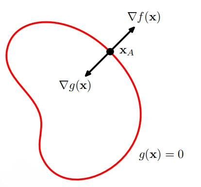

Every economics student learns constrained optimization. Firms maximize profit subject to budget limits; consumers maximize utility subject to income constraints. The Lagrange multiplier method is the standard tool to solve these problems — yet many learners treat it as a mechanical calculus trick without grasping its powerful economic meaning. The multiplier is far more than just an extra variable for taking derivatives: it represents a shadow price, and this interpretation is where most confusion arises.

{width="500px"}

### Historical context

Joseph‑Louis Lagrange developed this technique in the late 18th‑century for classical mechanics. Later economists transplanted this mathematical tool into microeconomics. Lagrange himself focused purely on mathematical solutions; the shadow‑price economic interpretation was added decades later by economists studying resource allocation.

### Setting up the Lagrangian

Suppose our objective is to maximize a utility function $U(x,y)$ subject to the budget constraint:

$$
p_x x + p_y y = I
$$

We construct the Lagrangian function by combining the objective and the constraint, weighted by a new variable $\lambda$:

$$
\mathcal{L}=U(x,y)+\lambda \big(I-p_x x-p_y y\big)
$$

Here $\lambda$ is our Lagrange multiplier. We solve by taking partial derivatives with respect to $x$, $y$, and $\lambda$, then setting each equal to zero:

$$
\frac{\partial \mathcal{L}}{\partial x}=\frac{\partial U}{\partial x}-\lambda p_x = 0,\quad
\frac{\partial \mathcal{L}}{\partial y}=\frac{\partial U}{\partial y}-\lambda p_y = 0,\quad
\frac{\partial \mathcal{L}}{\partial \lambda}=I-p_x x-p_y y =0
$$

Mathematically, $\lambda$ is just another unknown to solve for. Economically, it has a concrete definition.

**Key definition:**

When the constraint binds, the Lagrange multiplier $\lambda = \dfrac{\partial U^*}{\partial I}$. It measures how much the *maximized objective value* rises if we relax the constraint by one marginal unit. For consumers, this is marginal utility of additional income.

## Why it feels unintuitive

Calculus classes often teach only the algebra. Students compute first‑order conditions, solve for $x$ and $y$, and forget about $\lambda$. They see $\lambda$ as a computational nuisance rather than an economically meaningful number. It is easy to mix up its direction: $\lambda$ tells us how much the maximum utility changes, not how much $x$ or $y$ changes.

A very common student mistake is treating $\lambda$ as the price of good $x$ or good $y$. It is not a market price; it is an implicit, shadow value that exists only because the constraint binds. If the constraint does not bind — for instance, income is so high we cannot spend it all — then $\lambda=0$. Extra income brings zero additional utility.

## A numerical example

Imagine utility is Cobb‑Douglas: $U(x,y)=x^{0.5}y^{0.5}$, prices $p_x=p_y=1$, and initial income $I=10$. Solving the optimization gives optimal consumption $x^*=5$, $y^*=5$, maximized utility $U^*=5$, and multiplier $\lambda^*=0.5$.

What does $\lambda^*=0.5$ mean? If we increase income slightly from 10 to 11, the highest achievable utility rises to approximately 5.5. Adding one unit of income raises maximum utility by roughly 0.5 — matching our multiplier value. This is our shadow price: it values the constraint itself, not just the goods.

## Where it shows up in economics

This shadow‑price insight extends far beyond consumer theory. A firm maximizing output subject to a cost constraint: $\lambda$ is the marginal product of an extra dollar of cost. In public economics, constrained optimization for government spending gives multipliers that measure the welfare gain from relaxing a budget restriction. Even in data science, constrained regression uses Lagrange multipliers to interpret the cost of imposing restrictions on model parameters.

In every case, the logic is the same. Whenever a resource is scarce and binding, the Lagrange multiplier tells you its marginal implicit value. Algebra solves for quantities; the multiplier gives you the economic value of scarcity itself.

## Key Takeaway

Do not view the Lagrange multiplier $\lambda$ as just a calculus hack. When a constraint binds, it is a shadow price: it tells you how much your best possible outcome improves if you get a tiny bit more of your constrained resource. Whenever you compute a Lagrange multiplier, pause and ask: What resource is being constrained, and what is its marginal value here?
