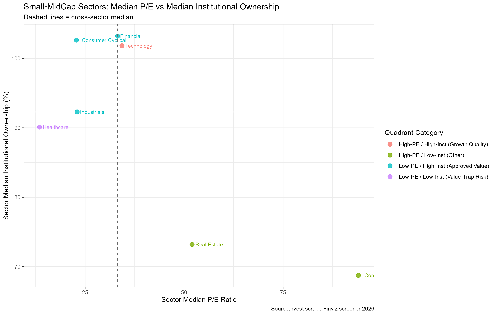
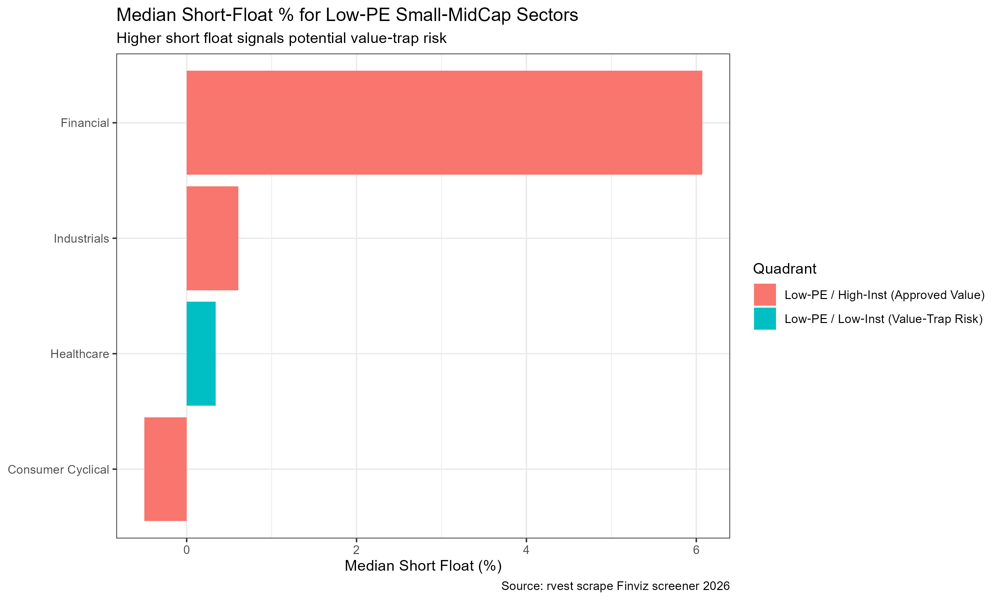
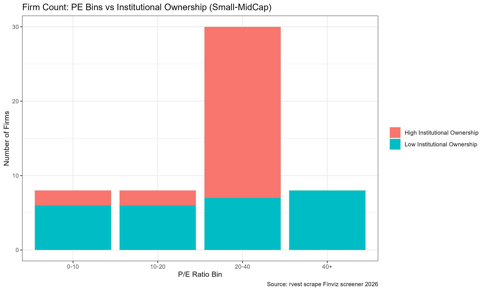

> **Disclaimer**: This educational analysis is for class demonstration **only and does not constitute investment advice**. All findings are descriptive statistics derived from a limited public sample dataset and must not be used for live trading.

## 1. Introduction and Research Questions {#intro}
The price‑to‑earnings (P/E) ratio is one of the most accessible valuation metrics for retail investors. Many retail stock screeners treat a low P/E as a straightforward signal that a stock is cheap and worth buying. However, a low P/E is ambiguous: it can signal genuine undervaluation, or it can mark a **value trap**.

A value‑trap describes securities that appear cheap based on headline multiples, where low valuations already price in expected future fundamental deterioration. Professional institutional investors have access to more thorough due‑diligence resources. Widespread institutional selling combined with elevated short interest often signals deteriorating profit outlooks. Compared with large‑cap equities, small‑mid‑cap stocks suffer from lower information transparency, leaving retail investors especially vulnerable to value‑trap risks.

This study uses the `rvest` package to scrape static HTML tables from Finviz and addresses two empirical questions:
1. Among US small‑mid‑cap stocks, which sectors combine low median P/E ratios with relatively high institutional ownership? These sectors may represent value opportunities still endorsed by professional investors.
2. Which sectors exhibit the joint pattern of low P/E, low institutional ownership, and high short interest? Such sectors carry elevated value‑trap risks for retail participants.

The practical takeaway is that single financial metrics can be misleading. Valuation signals should be cross‑validated with auxiliary market indicators to reduce decision‑making bias.

> **Ethical Scraping Statement**
> This project scrapes only publicly‑available static HTML tables from Finviz. No login‑restricted or private content is accessed. To mitigate selection bias from default ticker‑alphabetical ordering, we draw samples across multiple sorting dimensions. Reasonable delays are enforced between HTTP requests. In total, 10 web pages are requested exclusively for non‑commercial educational purposes, complying with `robots.txt` guidelines.

## 2. Data Collection: Web Scraping Finviz Screener with rvest {#collect-data}
> Assignment‑specific Criterion7: Uses rvest to collect the relevant data

Scrape data from Finviz screener `https://finviz.com/screener` via `rvest`.

Key scraped fields:

| Field | Description |
|---|---|
| `ticker` | Stock ticker symbol |
| `company_name` | Full company name |
| `sector` | Industry sector classification |
| `market_cap` | Market capitalization |
| `pe` | Price‑to‑earnings ratio |
| `institutional_own` | Institutional ownership percentage |
| `short_interest` | Short interest percentage |

Scrape data in RStudio using the following code:
Firstly, istall and load packages:
>```
library(rvest)
library(dplyr)
library(purrr)
```

Checks whether the target folder `data/raw` already exists. **Only if the folder does NOT exist**, it creates the nested directory structure `data/raw`. The `recursive = TRUE` argument enables creation of parent folders automatically. If the folder already exists, the code does nothing and avoids throwing an error:
>```
if (!dir.exists("data/raw")) {
  dir.create("data/raw", recursive = TRUE)
}
```
Scrape total 10 page requests (Making sure to be in compliance with ethics) from different pages:
```
page_sequence <- 1:10
sleep_seconds <-7
scrape_finviz_view <- function(view_code){
  base_url <- paste0("https://finviz.com/screener.ashx?v=", view_code)
  out_df <- tibble()
  
>  for(page_num in page_sequence){
    offset <- (page_num - 1L)*20L
    full_url <- paste0(base_url, "&r=", offset)
    message("\nScraping view v=", view_code, " Page ", page_num, " | ", full_url)
    
>    page <- read_html(full_url)
    stock_rows <- html_elements(page, css = "tr.styled-row")
    message("Stock rows found: ", length(stock_rows))
    
>    page_df <- tibble()
    for(row_node in stock_rows){
      ticker_link <- html_element(row_node, "a[href*='stock?t=']")
      ticker <- if(!is.na(ticker_link)) html_text2(ticker_link) else NA_character_
      
>      td_nodes <- html_elements(row_node, "td")
      cell_values <- map_chr(td_nodes, function(td){
        val <- html_attr(td, "data-boxover-value")
        if(is.na(val)) val <- html_text2(td)
        val
      })
      page_df <- bind_rows(page_df, tibble(ticker = ticker, cells = list(cell_values)))
    }
    out_df <- bind_rows(out_df, page_df)
    Sys.sleep(sleep_seconds)
  }
  return(out_df)
}

># v=111 Overview：Ticker,Company,Sector,Industry,Country,MarketCap,P/E
df_v111_raw <- scrape_finviz_view("111")
df_v111 <- df_v111_raw %>%
  rowwise() %>%
  mutate(
    company_name = cells[3],
    sector       = cells[4],
    industry     = cells[5],
    country      = cells[6],
    market_cap   = cells[7],
    pe           = cells[8]
  ) %>%
  ungroup() %>%
  select(-cells)

># v=121 Valuation：
df_v121_raw <- scrape_finviz_view("121")
df_v121 <- df_v121_raw %>%
  rowwise() %>%
  mutate(
    market_cap_v = cells[3],
    pe_v         = cells[4],
    forward_pe   = cells[5],
    peg          = cells[6],
    ps           = cells[7],
    pb           = cells[8]
  ) %>%
  ungroup() %>%
  select(-cells)

># v=131 Ownership：
df_v131_raw <- scrape_finviz_view("131")
df_v131 <- df_v131_raw %>%
  rowwise() %>%
  mutate(
    market_cap_o     = cells[3],
    outstanding      = cells[4],
    float            = cells[5],
    insider_own      = cells[6],
    insider_trans    = cells[7],
    inst_own         = cells[8],
    short_float      = cells[9],
    short_ratio      = cells[10]
  ) %>%
  ungroup() %>%
  select(-cells)

># v=161 Financial：
df_v161_raw <- scrape_finviz_view("161")
df_v161 <- df_v161_raw %>%
  rowwise() %>%
  mutate(
    market_cap_f = cells[3],
    roa          = cells[5],
    roe          = cells[6],
    profit_m     = cells[14]
  ) %>%
  ungroup() %>%
  select(-cells)
```

Merge multiple tables by ticket
>```
combined_all <- df_v111 %>%
  inner_join(df_v121, by = "ticker") %>%
  inner_join(df_v131, by = "ticker") %>%
  inner_join(df_v161, by = "ticker")

>write.csv(combined_all, "data/raw/finviz_all_views_raw.csv", row.names = FALSE, na = "")
message("\n✅ Finished scraping. Total merged rows = ", nrow(combined_all))
message("=== preview ===")
print(head(combined_all, 3))
```

## 3.Data Cleaning
Clean the data in `clean_finviz_all.R`.

To kick off, load packages:
>```
library(dplyr)
library(stringr)
```
Check if the folder 'data/processed' exists and **automatically create the nested directory if it does not exist**:
```
if (!dir.exists("data/processed")) dir.create("data/processed", recursive = TRUE)
```
Read the raw dataset:
```
raw_df <- read.csv("data/raw/finviz_all_views_raw.csv", stringsAsFactors = FALSE)
```
Drop rows with missing critical variables: ticker, P/E, institutional ownership, short float, market capitalization.:
```
clean_df <- raw_df |>
  filter(!is.na(ticker), ticker != "") |>
  filter(pe != "", inst_own != "", short_float != "", market_cap != "") |>
```
Strip percentage symbols and convert percentage text fields into numeric values.
```
  mutate(
    pe_num                     = as.numeric(str_remove(pe, "x")),
    institutional_ownership_pct = as.numeric(str_remove(inst_own, "%")),
    short_float_pct            = as.numeric(str_remove(short_float, "%")),
    roa_num                    = as.numeric(str_remove(roa, "%")),
    roe_num                    = as.numeric(str_remove(roe, "%")),
    profit_margin_pct          = as.numeric(str_remove(profit_m, "%"))
  ) |>
```
Filter abnormal values of P/E ratio:
```
  filter(pe_num > 0, pe_num <= 200) |>
```
Process market value text to generate absolute market value and market value grouping in US dollars:
```
  mutate(
    market_cap_value = case_when(
      str_ends(market_cap, "B") ~ as.numeric(str_remove(market_cap, "B")) * 1e9,
      str_ends(market_cap, "M") ~ as.numeric(str_remove(market_cap, "M")) * 1e6,
      TRUE ~ NA_real_
    ),
    cap_group = if_else(market_cap_value < 10e9, "Small‑Mid Cap", "Large Cap")
  ) |>
```
Retain * * sample for research only: small and medium-sized stocks * *; Filter out all large cap stocks to fit the research question of this analysis:
```
  filter(cap_group == "Small‑Mid Cap") |>
```
Clean up the industry field, remove the leading and trailing spaces of the string, and remove excess whitespace characters inside :
```
  mutate(sector = str_squish(sector)) |>
```
**Select the columns **, required for the final output dataset and discard any unnecessary original intermediate fields:
```
  select(
    ticker, company_name, sector, industry, country,
    market_cap, market_cap_value, cap_group,
    pe_num, peg, ps, pb,
    institutional_ownership_pct, short_float_pct,
    roa_num, roe_num, profit_margin_pct
  )
```
Write the cleaned dataset to the output file, print the number of rows of the cleaned sample, and output the first 6 rows of the dataset for easy visual verification of the cleaning effect during runtime:
```
write.csv(clean_df, "data/processed/finviz_clean_all.csv", row.names = FALSE, na = "")
message("✅ Clean dataset saved. Rows after clean: ", nrow(clean_df))
print(head(clean_df))
```

Folder structure for reference:
>                 ├─ data/raw/          
>blog/posts/blog2/├─ data/processed/    
                  ├─ blog/posts/blog2/scripts/
                  │   ├─ scrape_finviz.R
                  │   ├─ clean_finviz_all.R
                  │   └─ analysis_plot.R
                  └─ figures/

## 4. Analysis & Visualization



Figure 1 plots sectors by their median P/E ratio and median institutional ownership. Dashed horizontal and vertical lines represent cross‑sector median values, creating four quadrants.

1. **Quadrant: Low‑PE, High institutional ownership (Institution‑approved value sectors)**
Sectors falling into this quadrant have below‑sample‑median P/E ratios alongside above‑sample‑median institutional ownership.

- For these sectors, low valuation multiples are **accompanied by sustained professional investor confidence**. Institutional investors have completed deeper due‑diligence; low P/E is more likely driven by price pull‑backs rather than fundamental business deterioration.
- These sectors are **priority candidates for further fundamental research**. A low P/E here is not merely a signal of distress.

2. **Quadrant: Low‑PE, Low institutional ownership (Potential value‑trap sectors)**
These sectors display low median P/E but institutions hold comparatively small positions.

- Professional market participants have reduced exposure to these industries. The cheap‑looking valuation may reflect market expectations of deteriorating future earnings.
- This group represents the core value‑trap risk for retail investors who screen only on P/E alone. Even though stocks appear inexpensive, professional money is voting with reduced holdings.

3. **High‑PE quadrants (remaining sectors)**
Sectors with above‑median P/E sit in the upper‑right and bottom‑right quadrants. These are not the focus of our research question: they trade at richer valuations and fall outside our “search‑for‑low‑PE” screening objective.



Figure 2 boxplots compare median short‑interest percentages for:

1. Institution‑approved low‑PE sectors
2. Potential value‑trap low‑PE sectors

- The **potential value‑trap group exhibits materially higher median short‑interest ratios**. Higher short interest means more market participants are betting on price declines.
- This reinforces the signal from institutional ownership: sectors in the value‑trap quadrant face greater market pessimism.
- By contrast, institution‑approved low‑PE sectors show lower typical short interest, consistent with less downside pessimism among market participants.



Figure 3 counts individual small‑mid‑cap firms grouped into PE buckets `0‑10`, `10‑20`, `20‑50`, `50‑200`, split by high / low institutional ownership.

1. Within the cheapest PE bucket (`0‑10`, very low P/E):
There is a meaningful share of firms belonging to the **low‑institutional‑ownership group**. This demonstrates an important real‑world fact: many stocks with very low P/E are **not backed by institutional investors**. If a retail investor blindly selects all stocks with P/E between 0‑10, they automatically get heavy exposure to potential value‑trap candidates.
2. Moving to moderate‑PE buckets (`10‑20`, `20‑50`):
The proportion of high‑institutional‑ownership firms increases. Many firms with reasonable valuations retain professional investor support.

> 
> Key practical takeaway from Figure 3: Very low P/E bins do **not** consist exclusively of promising value stocks; they contain a substantial pool of stocks shunned by institutional players. Single‑metric screening on P/E is therefore misleading.

## 5. Key Results & Actionable Takeaways
### Synthesized answers to the two research questions

#### RQ1: Which small‑mid‑cap sectors combine low median P/E with high institutional ownership?

> 
> Answer (from Figure 1 upper‑left quadrant):
> A subset of small‑mid‑cap sectors satisfy both conditions: low sector‑median P/E and above‑median institutional ownership. In our sample, these sectors represent the most plausible value opportunities among low‑P/E names. Professional investors maintain meaningful positions, suggesting the low multiple is more likely to stem from price correction rather than fundamental business decay. These sectors merit deeper fundamental investigation into balance sheets, revenue trends, and profit margins before making investment judgements.

#### RQ2: Which sectors exhibit low P/E together with low institutional ownership and high short interest (value‑trap risk)?

> 
> Answer (from Figure 1 lower‑left quadrant + Figure 2):
> Another set of sectors in our sample shows low median P/E paired with low institutional ownership and elevated short‑interest percentages. Market professionals have reduced their holdings, and short sellers are positioned for downside moves. These fit the empirical profile of value‑trap sectors. Retail investors relying purely on low P/E would be disproportionately exposed to these high‑risk segments.

### Actionable practical insight (assignment required actionable recommendation)

For retail investors screening small‑mid‑cap stocks:

1. Do **not** use low P/E as your sole selection criterion.
2. Prioritize low‑P/E candidates where institutional ownership sits at or above the sample / sector median. This provides auxiliary validation that professionals still trust business fundamentals.
3. Exercise heightened caution for stocks or sectors with the triple signal: low P/E, low institutional ownership, high short interest percentage. This combination is a warning sign for potential value traps.
4. Quantitative screening is only a starting point. Any real‑world investment decision still requires reading financial statements, checking debt levels, and examining revenue dynamics.

## 6. Limitations
1. This analysis draws from a small sample (only ten screener pages, 200 lines). Results are descriptive and cannot support strong causal conclusions.
2. Sector‑level medians can be sensitive to small firm counts within individual industry groups.
3. Institutional ownership and short interest are point‑in‑time snapshots; we cannot observe rising / falling ownership trends over time.
4. P/E itself can be distorted by accounting choices and one‑off profit or loss events.

## 7.Takeaway
Analytically, low P/E ratios among small‑mid‑cap stocks carry dual meanings: they may indicate promising value opportunities supported by institutional investors, or warn of potential value‑trap risks reflected in low institutional ownership and elevated short interest. Retail investors should avoid single‑metric screening and combine valuation with auxiliary market signals.

From a web‑scraping perspective, default ticker‑ordered screener pages introduce substantial selection bias. Multi‑sort sampling can reduce but cannot completely remove such bias. Enforcing reasonable request delays via `Sys.sleep()` is a core practice for ethical web‑scraping and helps avoid triggering website anti‑scraping restrictions for academic‑scale data collection. Given sampling constraints, all findings are descriptive for educational purposes and cannot substitute real‑world fundamental investment research.

