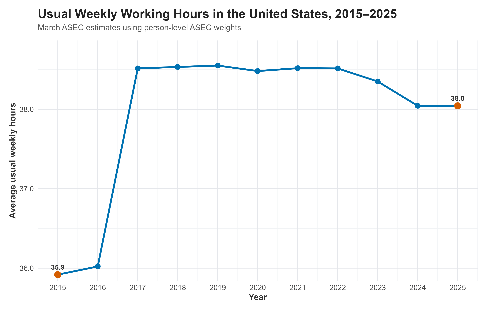
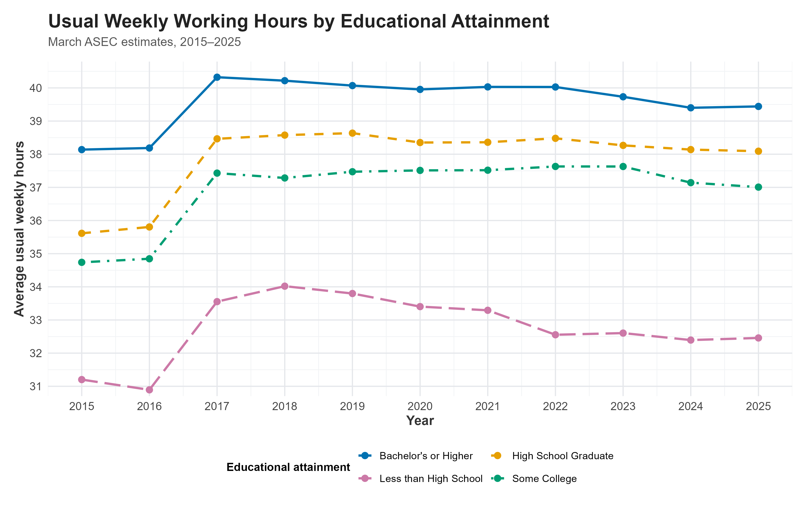
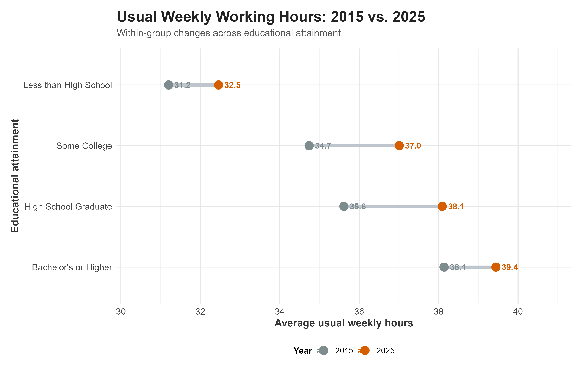
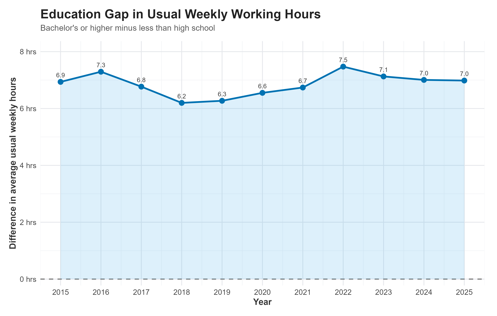
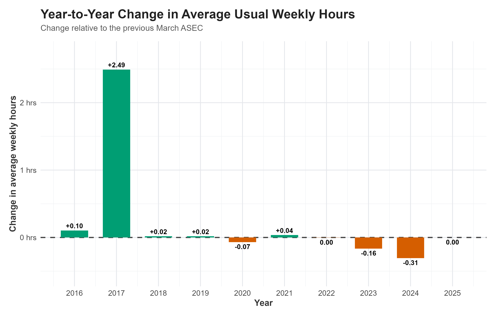
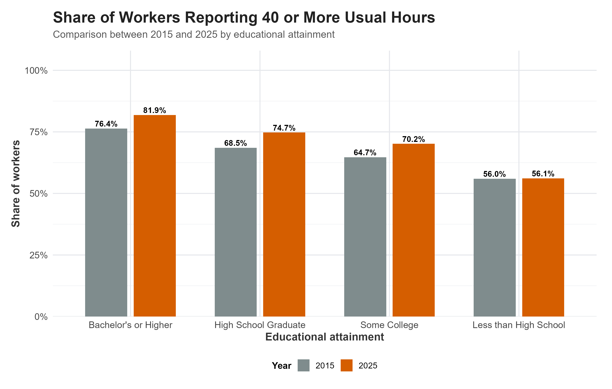

# Research question

This blog asks:

> **How did usual weekly working hours change among U.S. workers between 2015 and 2025, and how did these changes differ across educational attainment groups?**

Working hours are an economically meaningful measure of labor-market behavior. Changes in hours can reflect changes in labor demand, employment arrangements, worker preferences, and the composition of the workforce. Education is especially relevant because workers with different levels of educational attainment tend to sort into different occupations and industries, which can generate systematic differences in hours worked.

The analysis therefore focuses on two related questions:

1. **How did the average U.S. workweek evolve from 2015 to 2025?**
2. **Did the evolution of working hours differ across educational attainment groups?**

The goal is descriptive rather than causal. The figures document patterns in the CPS data; they do not identify the causal effect of any particular policy, recession, industry shock, or other event.

# Data and Measurement

## Data source

The data come from the **IPUMS Current Population Survey (CPS) Annual Social and Economic Supplement (ASEC)**. I use the March ASEC sample consistently from 2015 through 2025.

The key IPUMS documentation used in this analysis is:

- [IPUMS CPS: Sample Weights](https://cps.ipums.org/cps/sample_weights.shtml)
- [IPUMS CPS: ASECWT](https://cps.ipums.org/cps-action/variables/446060)
- [IPUMS CPS: UHRSWORK1](https://cps.ipums.org/cps-action/variables/418415)
- [IPUMS CPS: EDUC](https://cps.ipums.org/cps-action/variables/EDUC)
- [IPUMS CPS: Technical Documentation](https://cps.ipums.org/cps/technical_documents.shtml)

These sources document the choice of ASEC weights, the definition of usual hours at the main job, the coding of educational attainment, and relevant CPS comparability issues.

The main outcome is `UHRSWORK1`, which measures the number of hours a respondent **usually works per week at their main job**. IPUMS codes `99` as "99 hours per week or more," while `997` denotes hours that vary and `999` denotes not in universe. Therefore, for calculations of the average number of hours, I retain exact reported values from 0 through 98. For the separate 40-or-more-hours analysis, I include the 99+ category.

For population statistics, I use `ASECWT`, the person-level ASEC weight. IPUMS specifically recommends `ASECWT` for person-level analyses of ASEC data, while `WTFINL` is intended for basic monthly CPS analyses [IPUMS CPS weights](https://cps.ipums.org/cps/sample_weights.shtml).

Educational attainment is measured using the IPUMS `EDUC` variable. IPUMS recommends using the first two digits of `EDUC` for comparability across time. I group respondents into four broad categories: less than high school, high school graduate, some college, and bachelor's degree or higher.

## Why March ASEC?

The extract contains both monthly CPS observations and ASEC observations. A consistent annual comparison requires using the same type of sample and the same weight in every year. Because `ASECWT` is an ASEC-specific person weight, this analysis uses the March ASEC consistently rather than mixing monthly CPS observations with ASEC observations.

This choice also avoids the problem encountered when using `WTFINL` on this extract: the Basic Monthly weight is not available for the March ASEC observations in the earlier years in the same way needed for this analysis. The resulting sample is therefore defined consistently across all years.

## R code:

The following code reads the IPUMS extract, verifies that the required variables are present, and creates the analysis sample.

```{r}
#| message: false
#| warning: false


# 1. Packages

required_packages <- c(
  "ipumsr",
  "dplyr",
  "ggplot2",
  "scales",
  "readr",
  "tidyr"
)

for (pkg in required_packages) {
  if (!requireNamespace(pkg, quietly = TRUE)) {
    install.packages(pkg)
  }
}

library(ipumsr)
library(dplyr)
library(ggplot2)
library(scales)
library(readr)
library(tidyr)


# 2. Project paths

project_dir <- "D:/6400/Github/mywebsite/blog/posts/blog3"

ddi_file <- file.path(
  project_dir,
  "cps_00002.xml"
)

data_file <- file.path(
  project_dir,
  "cps_00002.dat"
)

fig_dir <- file.path(
  project_dir,
  "figures"
)

dir.create(
  fig_dir,
  showWarnings = FALSE,
  recursive = TRUE
)


# 3. Read IPUMS DDI

ddi <- read_ipums_ddi(
  ddi_file
)


# 4. Verify variables

required_vars <- c(
  "YEAR",
  "MONTH",
  "EMPSTAT",
  "UHRSWORK1",
  "EDUC",
  "ASECWT"
)

available_variables <- ipums_var_info(ddi)$var_name

missing_vars <- setdiff(
  required_vars,
  available_variables
)

if (length(missing_vars) > 0) {
  stop(
    paste(
      "The following variables are missing from the IPUMS extract:",
      paste(missing_vars, collapse = ", ")
    )
  )
}


# 5. Read microdata

cps <- read_ipums_micro(
  ddi,
  data_file = data_file,
  vars = required_vars
)


# 6. Convert variables to numeric

cps <- cps %>%
  mutate(
    YEAR_num = as.numeric(YEAR),
    MONTH_num = as.numeric(MONTH),
    EMPSTAT_num = as.numeric(EMPSTAT),
    UHRSWORK1_num = as.numeric(UHRSWORK1),
    EDUC_num = as.numeric(EDUC),
    ASECWT_num = as.numeric(ASECWT)
  )


# 7. Educational attainment

cps <- cps %>%
  mutate(
    EDUC2 = floor(
      EDUC_num / 10
    ),

    education_group = case_when(

      EDUC2 >= 0 &
        EDUC2 <= 6 ~
        "Less than High School",

      EDUC2 == 7 ~
        "High School Graduate",

      EDUC2 >= 8 &
        EDUC2 <= 10 ~
        "Some College",

      EDUC2 >= 11 &
        EDUC2 <= 12 ~
        "Bachelor's or Higher",

      TRUE ~ NA_character_
    )
  )


# 8. Analysis sample for mean hours

cps_analysis <- cps %>%
  filter(

    YEAR_num >= 2015,
    YEAR_num <= 2025,

    # March ASEC
    MONTH_num == 3,

    # Employed respondents
    EMPSTAT_num %in% c(10, 12),

    # Exact usual hours
    !is.na(UHRSWORK1_num),
    UHRSWORK1_num >= 0,
    UHRSWORK1_num <= 98,

    # ASEC person weight
    !is.na(ASECWT_num),
    ASECWT_num > 0,

    # Valid education group
    !is.na(education_group)
  )


# 9. Weighted mean function

weighted_mean <- function(x, w) {

  valid <- (
    !is.na(x) &
    !is.na(w) &
    is.finite(x) &
    is.finite(w) &
    w > 0
  )

  if (!any(valid)) {
    return(NA_real_)
  }

  sum(
    x[valid] * w[valid]
  ) /
    sum(
      w[valid]
    )
}


# 10. Overall trend

overall_hours <- cps_analysis %>%
  group_by(YEAR_num) %>%
  summarise(
    avg_hours =
      weighted_mean(
        UHRSWORK1_num,
        ASECWT_num
      ),
    .groups = "drop"
  )


# 11. Education-specific trend

education_hours <- cps_analysis %>%
  group_by(
    YEAR_num,
    education_group
  ) %>%
  summarise(
    avg_hours =
      weighted_mean(
        UHRSWORK1_num,
        ASECWT_num
      ),
    .groups = "drop"
  )


# 12. Education gap

education_gap <- education_hours %>%
  select(
    YEAR_num,
    education_group,
    avg_hours
  ) %>%
  pivot_wider(
    names_from = education_group,
    values_from = avg_hours
  ) %>%
  mutate(
    education_gap =
      `Bachelor's or Higher` -
      `Less than High School`
  )


# 13. Year-to-year change

yoy_change <- overall_hours %>%
  arrange(YEAR_num) %>%
  mutate(
    change_hours =
      avg_hours -
      lag(avg_hours)
  ) %>%
  filter(
    !is.na(change_hours)
  )


# 14. Separate 40+ hours sample

cps_40plus <- cps %>%
  filter(

    YEAR_num >= 2015,
    YEAR_num <= 2025,

    MONTH_num == 3,

    EMPSTAT_num %in% c(10, 12),

    !is.na(UHRSWORK1_num),
    UHRSWORK1_num >= 0,
    UHRSWORK1_num <= 99,

    !is.na(ASECWT_num),
    ASECWT_num > 0,

    !is.na(education_group)
  ) %>%
  mutate(
    hours_40plus =
      UHRSWORK1_num >= 40
  )


# 15. Share working 40+ hours

share_40plus <- cps_40plus %>%
  group_by(
    YEAR_num,
    education_group
  ) %>%
  summarise(
    share_40plus =
      weighted_mean(
        as.numeric(hours_40plus),
        ASECWT_num
      ),
    .groups = "drop"
  )


# 16. Endpoint comparison

comparison_2015_2025 <- education_hours %>%
  filter(
    YEAR_num %in% c(2015, 2025)
  ) %>%
  mutate(
    year_label =
      as.character(YEAR_num)
  )


# 17. Values used in the text

overall_2015 <-
  overall_hours %>%
  filter(YEAR_num == 2015) %>%
  pull(avg_hours)

overall_2025 <-
  overall_hours %>%
  filter(YEAR_num == 2025) %>%
  pull(avg_hours)

overall_change <-
  overall_2025 -
  overall_2015

gap_2015 <-
  education_gap %>%
  filter(YEAR_num == 2015) %>%
  pull(education_gap)

gap_2025 <-
  education_gap %>%
  filter(YEAR_num == 2025) %>%
  pull(education_gap)

largest_increase <-
  yoy_change %>%
  slice_max(
    change_hours,
    n = 1
  )

largest_decrease <-
  yoy_change %>%
  slice_min(
    change_hours,
    n = 1
  )


# 18. Education changes

education_change <- education_hours %>%
  filter(
    YEAR_num %in% c(2015, 2025)
  ) %>%
  select(
    YEAR_num,
    education_group,
    avg_hours
  ) %>%
  pivot_wider(
    names_from = YEAR_num,
    values_from = avg_hours,
    names_prefix = "hours_"
  ) %>%
  mutate(
    change_hours =
      hours_2025 -
      hours_2015
  )


# 19. Colors

education_colors <- c(
  "Bachelor's or Higher" = "#0072B2",
  "High School Graduate" = "#E69F00",
  "Some College" = "#009E73",
  "Less than High School" = "#CC79A7"
)

year_colors <- c(
  "2015" = "#7F8C8D",
  "2025" = "#D55E00"
)


# 20. Common theme

blog_theme <- theme_minimal(
  base_size = 14
) +
  theme(

    plot.title =
      element_text(
        size = 20,
        face = "bold",
        color = "#222222",
        margin =
          margin(
            b = 6
          )
      ),

    plot.subtitle =
      element_text(
        size = 13,
        color = "#555555",
        margin =
          margin(
            b = 14
          )
      ),

    axis.title =
      element_text(
        size = 14,
        face = "bold",
        color = "#333333"
      ),

    axis.text =
      element_text(
        size = 12,
        color = "#444444"
      ),

    legend.title =
      element_text(
        size = 12,
        face = "bold"
      ),

    legend.text =
      element_text(
        size = 11
      ),

    legend.position =
      "bottom",

    panel.grid.major =
      element_line(
        color = "#E5E7EB",
        linewidth = 0.6
      ),

    panel.grid.minor =
      element_line(
        color = "#F1F3F5",
        linewidth = 0.35
      ),

    plot.margin =
      margin(
        15, 20, 15, 15
      )
  )
```

The figures below are all calculated from the same `cps_analysis` object.

# visualizations

## Figure 1: Overall Evolution of Working Hours

{width="500px"}

The overall series shows a clear change in the level of reported usual weekly hours between 2016 and 2017. After that increase, the series is relatively stable through 2022, followed by a moderate decline in 2023 and 2024.

The endpoint values are approximately **`r sprintf("%.1f", overall_2015)` hours in 2015** and **`r sprintf("%.1f", overall_2025)` hours in 2025**, a net change of about **`r sprintf("%+.1f", overall_change)` hours per week**.

The important economic point is that the 2015–2025 period is not characterized by a smooth linear trend. Instead, most of the visible movement occurs in particular parts of the period, especially the sharp increase around 2017 and the decline after 2022.

The 2016–2017 discontinuity should be interpreted cautiously. IPUMS documentation notes changes in CPS ASEC processing around the 2017–2019 period and advises caution when comparing affected estimates with later ASEC files. Therefore, the jump is an observed feature of the series, not evidence by itself of a causal economic shock.

**R code:**

```{r}
#| message: false
#| warning: false

fig1 <- ggplot(
  overall_hours,
  aes(
    x = YEAR_num,
    y = avg_hours
  )
) +

  geom_line(
    linewidth = 1.4,
    color = "#0072B2"
  ) +

  geom_point(
    size = 3.5,
    color = "#0072B2"
  ) +

  geom_point(
    data =
      overall_hours %>%
      filter(
        YEAR_num %in% c(2015, 2025)
      ),
    size = 4.5,
    color = "#D55E00"
  ) +

  geom_text(
    data =
      overall_hours %>%
      filter(
        YEAR_num %in% c(2015, 2025)
      ),
    aes(
      label =
        sprintf(
          "%.1f",
          avg_hours
        )
    ),
    vjust = -1.0,
    size = 4,
    fontface = "bold",
    color = "#333333"
  ) +

  scale_x_continuous(
    breaks = 2015:2025
  ) +

  scale_y_continuous(
    labels =
      function(x) {
        sprintf(
          "%.1f",
          x
        )
      },
    expand =
      expansion(
        mult = c(
          0.03,
          0.12
        )
      )
  ) +

  labs(
    title =
      "Usual Weekly Working Hours in the United States, 2015–2025",
    subtitle =
      "March ASEC estimates using person-level ASEC weights",
    x = "Year",
    y =
      "Average usual weekly hours"
  ) +

  blog_theme

ggsave(
  file.path(
    fig_dir,
    "figure1_overall_trend.png"
  ),
  fig1,
  width = 11,
  height = 7,
  dpi = 300
)
```

## Figure 2: Differences Across Educational Attainment

{width="500px"}

Figure 2 reveals a persistent education gradient in usual weekly working hours. Workers with a bachelor's degree or higher generally report the longest usual workweeks, while workers with less than a high school education report the shortest.

The ordering is important because it is present throughout the period rather than appearing only in one year. The figure therefore suggests that educational attainment is associated with systematic differences in the amount of usual weekly labor supplied.

The changes are also not identical across groups. For example, the increase between 2015 and 2025 is much larger for workers with a high school diploma or some college than for workers with less than high school education. This means that looking only at the national average would conceal meaningful heterogeneity across education groups.

These differences should still be interpreted as descriptive associations. Education is correlated with occupation, industry, age, labor-force attachment, and other characteristics, so this figure does not identify a causal effect of education on working hours.

**R code:**

```{r}
#| message: false
#| warning: false

fig2 <- ggplot(
  education_hours,
  aes(
    x = YEAR_num,
    y = avg_hours,
    color = education_group,
    linetype = education_group
  )
) +

  geom_line(
    linewidth = 1.15
  ) +

  geom_point(
    size = 2.8
  ) +

  scale_color_manual(
    values = education_colors
  ) +

  scale_linetype_manual(
    values = c(
      "Bachelor's or Higher" = "solid",
      "High School Graduate" = "dashed",
      "Some College" = "dotdash",
      "Less than High School" = "longdash"
    )
  ) +

  scale_x_continuous(
    breaks = 2015:2025
  ) +

  scale_y_continuous(
    breaks = seq(
      30,
      41,
      1
    ),
    expand =
      expansion(
        mult = c(
          0.02,
          0.05
        )
      )
  ) +

  labs(
    title =
      "Usual Weekly Working Hours by Educational Attainment",
    subtitle =
      "March ASEC estimates, 2015–2025",
    x = "Year",
    y =
      "Average usual weekly hours",
    color =
      "Educational attainment",
    linetype =
      "Educational attainment"
  ) +

  guides(
    color =
      guide_legend(
        nrow = 2,
        byrow = TRUE
      ),
    linetype =
      guide_legend(
        nrow = 2,
        byrow = TRUE
      )
  ) +

  blog_theme

ggsave(
  file.path(
    fig_dir,
    "figure2_education_trends.png"
  ),
  fig2,
  width = 12,
  height = 7.5,
  dpi = 300
)
```

## Figure 3: How Much Did Each Education Group Change?

{width="500px"}

Figure 3 provides a more direct comparison of the endpoints. The horizontal distance between the two dots represents the change in usual weekly hours for each education group.

The figure shows that the increase from 2015 to 2025 is not uniform. The largest endpoint increase occurs among high school graduates, followed by workers with some college and workers with a bachelor's degree or higher. The change among workers with less than a high school education is comparatively small.

This is economically informative because the national average can remain relatively stable even when the distribution of hours changes substantially across groups. The endpoint comparison makes that heterogeneity immediately visible.

**R code:**

```{r}
#| message: false
#| warning: false

fig3_data <- comparison_2015_2025 %>%
  mutate(
    education_group =
      factor(
        education_group,
        levels = c(
          "Bachelor's or Higher",
          "High School Graduate",
          "Some College",
          "Less than High School"
        )
      )
  )

fig3_segments <- comparison_2015_2025 %>%
  group_by(
    education_group
  ) %>%
  summarise(
    x_start =
      avg_hours[
        YEAR_num == 2015
      ],

    x_end =
      avg_hours[
        YEAR_num == 2025
      ],

    .groups = "drop"
  )

fig3 <- ggplot(
  fig3_data,
  aes(
    x = avg_hours,
    y = education_group
  )
) +

  geom_segment(
    data = fig3_segments,
    aes(
      x = x_start,
      xend = x_end,
      y = education_group,
      yend = education_group
    ),
    linewidth = 2,
    color = "#BFC5CC"
  ) +

  geom_point(
    aes(
      color = year_label
    ),
    size = 5
  ) +

  geom_text(
    aes(
      label =
        sprintf(
          "%.1f",
          avg_hours
        ),
      color = year_label
    ),
    hjust = -0.35,
    size = 4,
    fontface = "bold"
  ) +

  scale_color_manual(
    values = year_colors,
    name = "Year"
  ) +

  scale_x_continuous(
    limits = c(
      30,
      40.5
    ),
    breaks = seq(
      30,
      40,
      2
    ),
    expand =
      expansion(
        mult = c(
          0.01,
          0.08
        )
      )
  ) +

  labs(
    title =
      "Usual Weekly Working Hours: 2015 vs. 2025",
    subtitle =
      "Within-group changes across educational attainment",
    x =
      "Average usual weekly hours",
    y =
      "Educational attainment"
  ) +

  blog_theme

ggsave(
  file.path(
    fig_dir,
    "figure3_2015_vs_2025.png"
  ),
  fig3,
  width = 11,
  height = 7,
  dpi = 300
)
```

## Figure 4: The Education Gap in Working Hours

{width="500px"}

Figure 4 summarizes the gap between the highest and lowest education groups.

The gap is approximately **`r sprintf("%.1f", gap_2015)` hours per week in 2015** and **`r sprintf("%.1f", gap_2025)` hours in 2025**. Thus, despite changes in the individual group averages, the difference between these two education groups remains substantial throughout the sample period.

This provides a useful inequality-style perspective on the labor market. The relevant economic question is not only whether average hours changed, but also whether the distribution of work time became more or less differentiated across groups.

The figure does not establish why the gap exists. A complete explanation would require controls for occupation, industry, age, gender, family structure, and other labor-market characteristics.\

**R code:**

```{r}
#| message: false
#| warning: false

fig4 <- ggplot(
  education_gap,
  aes(
    x = YEAR_num,
    y = education_gap
  )
) +

  geom_hline(
    yintercept = 0,
    linetype = "dashed",
    linewidth = 0.8,
    color = "#777777"
  ) +

  geom_ribbon(
    aes(
      ymin = 0,
      ymax = education_gap
    ),
    fill = "#56B4E9",
    alpha = 0.20
  ) +

  geom_line(
    linewidth = 1.3,
    color = "#0072B2"
  ) +

  geom_point(
    size = 3.5,
    color = "#0072B2"
  ) +

  geom_text(
    aes(
      label =
        sprintf(
          "%.1f",
          education_gap
        )
    ),
    vjust = -1.0,
    size = 3.5,
    color = "#333333"
  ) +

  scale_x_continuous(
    breaks = 2015:2025
  ) +

  scale_y_continuous(
    labels =
      function(x) {
        paste0(
          x,
          " hrs"
        )
      },
    expand =
      expansion(
        mult = c(
          0.03,
          0.12
        )
      )
  ) +

  labs(
    title =
      "Education Gap in Usual Weekly Working Hours",
    subtitle =
      "Bachelor's or higher minus less than high school",
    x = "Year",
    y =
      "Difference in average usual weekly hours"
  ) +

  blog_theme

ggsave(
  file.path(
    fig_dir,
    "figure4_education_gap.png"
  ),
  fig4,
  width = 11,
  height = 7,
  dpi = 300
)
```

## Figure 5: Which Years Drive the Change?

{width="500px"}

Figure 5 decomposes the overall trend into annual changes. The largest positive change occurs in **`r largest_increase$YEAR_num`**, while the largest negative change occurs in **`r largest_decrease$YEAR_num`**.

This graph adds information that Figure 1 cannot provide as directly. Figure 1 shows the level of working hours over time, whereas Figure 5 identifies the years in which the level changed most strongly.

The economic interpretation should again remain descriptive. A large year-to-year change tells us when the measured workweek moved, but not what caused that movement.

**R code:**

```{r}
#| message: false
#| warning: false

fig5 <- ggplot(
  yoy_change,
  aes(
    x = YEAR_num,
    y = change_hours,
    fill = change_hours >= 0
  )
) +

  geom_hline(
    yintercept = 0,
    linetype = "dashed",
    linewidth = 0.9,
    color = "#444444"
  ) +

  geom_col(
    width = 0.65,
    show.legend = FALSE
  ) +

  geom_text(
    aes(
      label =
        ifelse(
          abs(change_hours) < 0.005,
          "0.00",
          sprintf(
            "%+.2f",
            change_hours
          )
        )
    ),
    vjust =
      ifelse(
        yoy_change$change_hours >= 0,
        -0.45,
        1.45
      ),
    size = 3.8,
    fontface = "bold"
  ) +

  scale_fill_manual(
    values = c(
      "TRUE" = "#009E73",
      "FALSE" = "#D55E00"
    )
  ) +

  scale_x_continuous(
    breaks = 2016:2025
  ) +

  scale_y_continuous(
    labels =
      function(x) {
        paste0(
          x,
          " hrs"
        )
      },
    expand =
      expansion(
        mult = c(
          0.15,
          0.15
        )
      )
  ) +

  labs(
    title =
      "Year-to-Year Change in Average Usual Weekly Hours",
    subtitle =
      "Change relative to the previous March ASEC",
    x = "Year",
    y =
      "Change in average weekly hours"
  ) +

  blog_theme

ggsave(
  file.path(
    fig_dir,
    "figure5_yoy_change.png"
  ),
  fig5,
  width = 11,
  height = 7,
  dpi = 300
)
```

## Figure 6: Share of Workers Working 40 or More Hours

{width="500px"}

Figure 6 provides a complementary distributional measure. Instead of asking how many hours the average worker reports, it asks what share of workers report a usual workweek of at least 40 hours.

The pattern is consistent with the mean-hours results but adds information about the distribution. In 2015, the share working at least 40 hours ranges from roughly **56% among workers with less than a high school education** to **76% among workers with a bachelor's degree or higher**. By 2025, the corresponding shares are approximately **56%** and **82%**.

The education gradient is therefore visible not only in average hours but also in the prevalence of 40-or-more-hour workweeks. This makes the result less dependent on a single mean and suggests that the education differences extend to the distribution of weekly work time.

```{r}
#| message: false
#| warning: false

share_40plus_comparison <-
  share_40plus %>%
  filter(
    YEAR_num %in% c(2015, 2025)
  ) %>%
  mutate(
    education_group =
      factor(
        education_group,
        levels = c(
          "Bachelor's or Higher",
          "High School Graduate",
          "Some College",
          "Less than High School"
        )
      ),

    year_label =
      factor(
        YEAR_num,
        levels = c(
          2015,
          2025
        )
      )
  )

fig6 <- ggplot(
  share_40plus_comparison,
  aes(
    x = education_group,
    y = share_40plus,
    fill = year_label
  )
) +

  geom_col(
    position =
      position_dodge(
        width = 0.75
      ),
    width = 0.65
  ) +

  geom_text(
    aes(
      label =
        percent(
          share_40plus,
          accuracy = 0.1
        )
    ),
    position =
      position_dodge(
        width = 0.75
      ),
    vjust = -0.35,
    size = 3.7,
    fontface = "bold"
  ) +

  scale_fill_manual(
    values = year_colors,
    name = "Year"
  ) +

  scale_y_continuous(
    labels =
      percent_format(
        accuracy = 1
      ),
    limits = c(
      0,
      1
    ),
    expand =
      expansion(
        mult = c(
          0,
          0.08
        )
      )
  ) +

  labs(
    title =
      "Share of Workers Reporting 40 or More Usual Hours",
    subtitle =
      "Comparison between 2015 and 2025 by educational attainment",
    x =
      "Educational attainment",
    y =
      "Share of workers"
  ) +

  blog_theme

ggsave(
  file.path(
    fig_dir,
    "figure6_40plus_hours.png"
  ),
  fig6,
  width = 11,
  height = 7,
  dpi = 300
)
```

# Bringing the Evidence Together

The six figures tell a coherent economic story.

**First, the national workweek does not move smoothly over the entire period.** Figure 1 shows a sharp increase around 2017, relative stability through 2022, and a decline in the later part of the sample.

**Second, the aggregate average hides important heterogeneity.** Figure 2 shows persistent differences across education groups. Workers with more education consistently report longer usual workweeks than workers with less education.

**Third, the endpoint comparison makes the size of those changes clearer.** Figure 3 shows that the 2015–2025 change differs substantially across educational attainment groups.

**Fourth, the education gap remains economically meaningful.** Figure 4 shows that the difference between workers with a bachelor's degree or higher and workers with less than high school education remains several hours per week throughout the period.

**Fifth, the timing of aggregate changes matters.** Figure 5 demonstrates that the overall trend is driven disproportionately by a small number of years rather than by a constant annual change.

**Finally, the mean is not the whole story.** Figure 6 shows that educational differences are also present in the share of workers reporting at least 40 usual hours per week.

Taken together, these results suggest that changes in U.S. working hours between 2015 and 2025 were characterized by both **time variation** and **persistent cross-sectional differences by education**. The overall average changed relatively modestly between the endpoints, but this masks meaningful differences in the evolution of hours across educational groups.

# Economic Interpretation

One possible economic interpretation is that education is associated with labor-market positions that differ systematically in their usual time requirements. Higher-educated workers are disproportionately represented in occupations where long standard workweeks are common, while workers with less formal education are more concentrated in occupations with different scheduling structures. However, the CPS descriptive statistics alone cannot separate the role of education from occupation, industry, age, demographic composition, or worker selection.

The results also illustrate why examining only an aggregate mean can be misleading. Suppose two groups experience very different changes in hours. If their population weights differ, the national mean can show only a small change even though the underlying distribution is shifting. Figures 2, 3, 4, and 6 therefore provide necessary context for interpreting Figure 1.

The 2017 increase deserves particular caution. It is tempting to attach an economic explanation to the visible discontinuity, but the data shown here do not establish such an explanation. IPUMS documentation describes changes in ASEC processing around the 2017–2019 period and recommends caution when comparing affected estimates with later files. The appropriate conclusion from this blog is therefore that the series **contains a pronounced observed change around 2017**, not that a particular event caused it.

# Limitations

There are several limitations to keep in mind.

### 1. Descriptive rather than causal

The analysis documents correlations and trends. It does not estimate the causal effect of education, economic conditions, or any particular policy on working hours.

### 2. Main job rather than all jobs

`UHRSWORK1` measures usual hours at the respondent's **main job**. Workers holding multiple jobs may therefore have total weekly hours that differ from the measure used here.

### 3. Top-coded hours

The value 99 represents **99 hours or more**, not exactly 99 hours. For this reason, observations coded 99 are excluded from the calculation of the mean number of hours but included in the 40-or-more-hours indicator.

### 4. Changes in population controls

IPUMS notes that the 2020 and 2021 ASEC weights were updated to reflect 2020-based population controls. IPUMS recommends the 2020-Census-based weights when comparing 2020/2021 ASEC with 2022 and later ASEC, and the older 2010-Census-based weights when comparing 2020/2021 with earlier years. The present analysis uses the current IPUMS `ASECWT` series for a straightforward 2015–2025 descriptive trend, so small differences attributable to changes in population controls cannot be ruled out.

### 5. Survey processing changes

IPUMS documentation also notes changes in ASEC processing around the 2017–2019 period. This is another reason to avoid interpreting the sharp 2017 movement as a causal economic effect without further investigation.

# Conclusion

The evidence from the March CPS ASEC shows that usual weekly working hours in the United States changed over 2015–2025, but the change was neither smooth nor uniform across educational groups.

The main findings are:

1. The national average workweek increased sharply around 2017 and then remained relatively stable for several years before declining in the early 2020s.
2. Workers with higher educational attainment consistently reported longer usual weekly hours than workers with lower educational attainment.
3. The change between 2015 and 2025 varied substantially across education groups.
4. The education-related gap in average weekly hours remained persistent over the period.
5. The share of workers reporting at least 40 usual weekly hours also shows a clear education gradient.

The central economic takeaway is therefore that **the evolution of working hours cannot be understood fully from the national average alone**. Educational differences remain an important dimension of the distribution of work time, and the timing of aggregate changes is also important.

# Reproducibility

The analysis is designed to be reproducible from the IPUMS CPS extract. The repository should contain the following structure:

```text
blog3/
├── index.qmd
├── cps_00002.xml
├── cps_00002.dat
├── scripts/
│   └── blog3_analysis.R
└── figures/
    ├── figure1_overall_trend.png
    ├── figure2_education_trends.png
    ├── figure3_2015_vs_2025.png
    ├── figure4_education_gap.png
    ├── figure5_yoy_change.png
    ├── figure6_40plus_hours.png
    ├── overall_hours.csv
    ├── education_hours.csv
    ├── comparison_2015_2025.csv
    ├── education_gap.csv
    ├── yoy_change.csv
    └── share_40plus.csv
```

To reproduce the analysis:

1. Place the IPUMS CPS `.xml` and `.dat` files in the project directory.
2. Open `index.qmd` in RStudio/Positron.
3. Ensure the packages `ipumsr`, `dplyr`, `ggplot2`, `scales`, `readr`, and `tidyr` are installed.
4. Render the Quarto document.
5. The analysis will regenerate the six figures and the intermediate CSV files programmatically.

# Takeaway

::: {.callout-tip appearance="default"}
## The takeaway

**The U.S. workweek did not change in the same way for everyone.** The national average rose sharply around 2017 and then was relatively stable before declining modestly in the early 2020s. At the same time, workers with different levels of educational attainment followed persistently different work-hour patterns.

The most important lesson from the analysis is that **an aggregate average can hide meaningful differences across groups**. Looking at educational attainment alongside the overall trend shows that the distribution of working time matters as much as the national average itself.

For readers interested in changes in the U.S. labor market, the evidence suggests two questions are worth keeping separate: **How is the average workweek changing?** and **Who is experiencing those changes?** This analysis shows why answering both questions provides a more informative economic picture than either one alone.

The results are descriptive rather than causal, so the observed changes should not be interpreted as evidence that education itself caused differences in working hours or that a particular event caused the changes over time.
:::